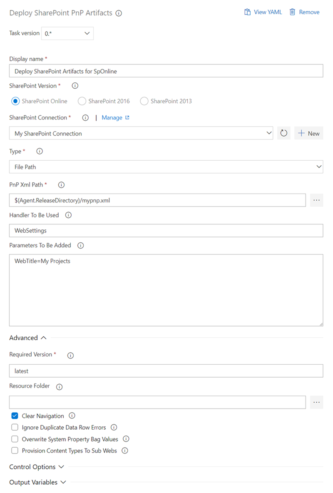

# Deploy SharePoint PnP Artifacts task

It uses the Apply-PnPProvisioningTemplate command from the PnP PowerShell Module.

[More Information](https://docs.microsoft.com/en-us/powershell/module/sharepoint-pnp/apply-pnpprovisioningtemplate?view=sharepoint-ps)

## YAML snippet

```YAML
# Deploy SharePoint PnP Artifacts task
# It uses the Apply-PnPProvisioningTemplate command from the PnP PowerShell Module.
- task: PnPDeploySpArtifacts@0
  inputs:
    sharepointConntection: 
    #FileOrInline: 'PnPXmlFilePath' # Optional. Options: File, Inline
    #PnPXmlFilePath: '# link your PnP provisioning xml file.' # Required when FileOrInline == File
    #PnPXmlInline: '# Write your PnP provisioning xml here.' # Required when FileOrInline == Inline
    #Handlers: list handlers that should be included only. # Optional
    #Parameters: set parameters. One parameter per line. # Optional
    #RequiredVersion: 'latest' # Optional set it to the version you want to use # Optional
    #ResourceFolder: #Optional
    #ClearNavigation: false # Optional
    #IgnoreDuplicateDataRowErrors: false # Optional
    #OverwriteSystemPropertyBagValues: false # Optional
    #ProvisionContentTypesToSubWebs: false # Optional
```

## Demands
[powershell](https://docs.microsoft.com/en-us/powershell/scripting/install/installing-windows-powershell?view=powershell-5.0)

## Arguments

<table>
    <thead>
        <tr>
            <th>Argument</th>
            <th>Description</th>
        </tr>
    </thead>
    <tr>
        <td>Display Name</td>
        <td></td>
    </tr>
    <tr>
        <td>SharePoint Version</td>
        <td>SharePoint version to witch the PnP xml should be deployed to.</td>
    </tr>
    <tr>
        <td>SharePoint Connection</td>
        <td>Select the SharePoint connection to SharePoint for the deployment. Create a new service connection to the SharePoint site where you want to connect to.</td>
    </tr>
    <tr>
        <td>Type</td>
        <td>Type of the PnP Xml: File Path or Inline Xml.</td>
    </tr>
    <tr>
        <td>Inline PnP Xml</td>
        <td>
            Allows you to specify xml containing the provisioning template.<br/><br/>
            Check the [existing schema](https://github.com/SharePoint/PnP-Provisioning-Schema) for a well formatted inline PnP xml.
        </td>
    </tr>
  <tr>
        <td>PnP Xml Path</td>
        <td>Path to the xml or pnp file containing the provisioning template.<br/><br/>
        Check the [existing schema](https://github.com/SharePoint/PnP-Provisioning-Schema) for a well formatted PnP xml file.</td>
    </tr>
    <tr>
        <td>Handler To Be Used</td>
        <td>Give a comma separated list of Handlers (e.g. Lists,Fields). Leave empty if all Handlers should be used.<br/> Allows you to only process a specific part of the template. Notice that this might fail, as some of the handlers require other artifacts in place if they are not part of what your applying.<br/><br/>
           Check for [available Handlers](https://msdn.microsoft.com/en-us/pnp_sites_core/officedevpnp.core.framework.provisioning.model.handlers).</td>
    </tr>
    <tr>
        <td>Parameters To Be Added</td>
        <td>Allows you to specify parameters that can be referred to in the template by means of the {parameter:} token.<br/><br/> See examples on it works internally [how to use this parameter](https://github.com/SharePoint/PnP-PowerShell/blob/master/Documentation/ApplyPnPProvisioningTemplate.md#example-3).<br/><br/> Example:<br/><br/> <i>ListTitle=Projects<br/>parameter2=a second value</i> <br/><br/> use only one parameter-value pair per line.</td>
    </tr>
    <tr>
        <th colspan="2">Advanced</td>
    </tr>
    <tr>
        <td>Required Version</td>
        <td>Set the version that should be loaded. Use 'latest' to always load the newest version. Check github for the released versions: https://github.com/SharePoint/PnP-PowerShell/releases</td>
    </tr>
     <tr>
        <td>Resource Folder</td>
        <td>Root folder where resources/files that are being referenced in the template are located. If not specified the same folder as where the provisioning template is located will be used.</td>
    </tr>
     <tr>
        <td>Clear Navigation</td>
        <td>Override the RemoveExistingNodes attribute in the Navigation elements of the template. If you specify this value the navigation nodes will always be removed before adding the nodes in the template.</td>
    </tr>
     <tr>
        <td>Ignore Duplicate Data Row Errors</td>
        <td>Ignore duplicate data row errors when the data row in the template already exists.</td>
    </tr>
     <tr>
        <td>Overwrite System Property Bag Values</td>
        <td>Specify this parameter if you want to overwrite and/or create properties that are known to be system entries (starting with vti_, dlc_, etc.)</td>
    </tr>
     <tr>
        <td>Provision Content Types To Sub Webs</td>
        <td>If set content types will be provisioned if the target web is a subweb.</td>
    </tr>
    <tr>
        <th colspan="2">
            [Control options](https://docs.microsoft.com/en-us/azure/devops/pipelines/process/tasks?view=azure-devops&tabs=yaml#controloptions)
        </th>
    </tr>
</table>

## Examples

The following example for YAML and the UI the task using a referenced PnP xml file that should be provisioned with the service connection 'My SharePoint Connection'. It deploys everything using inly the handler 'WebSettings', it clears the navigation on deployment and injects a parameter named 'WebTitle' which can be used in the XML file

### Yaml

```yaml
steps:
- task: PnPDeploySpArtifacts@0
  displayName: 'Deploy SharePoint Artifacts for SpOnline'
  inputs:
    sharepointConntection: 'My SharePoint Connection'
    FileOrInline: Path
    PnPXmlFilePath: '$(Agent.ReleaseDirectory)/mypnp.xml'
    Handlers: WebSettings
    Parameters: 'WebTitle=My Projects'
    ClearNavigation: true
```

### Classic UI



## Open source

This task is open source [on GitHub](https://github.com/pnp/sp-alm-devops-extension). Feedback and contributions are welcome.
